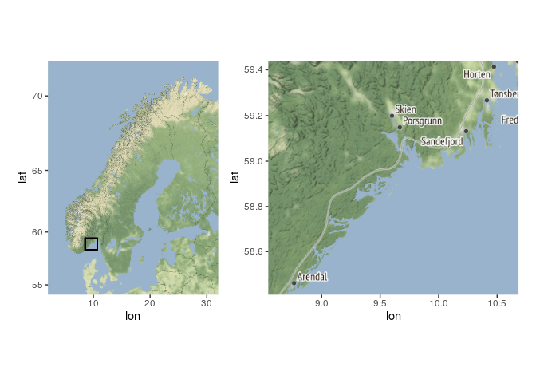
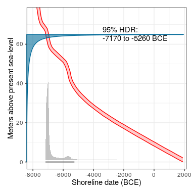
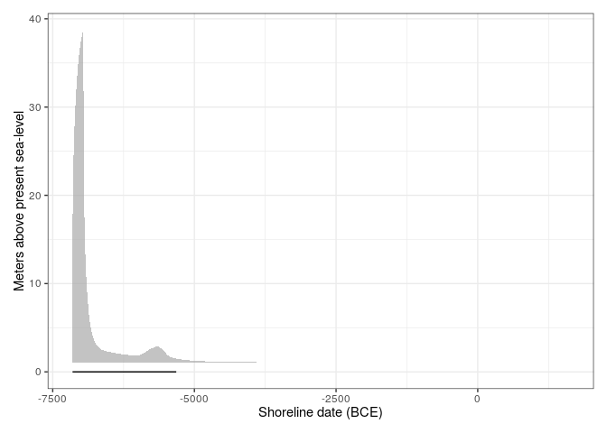

<!-- README.md is generated from README.Rmd. Please edit that file -->

# shoredate

<!-- badges: start -->

[](https://github.com/isakro/shoredate/actions/workflows/R-CMD-check.yaml)
[](https://app.codecov.io/gh/isakro/shoredate?branch=master)
<!-- badges: end -->

The goal of *shoredate* is to offer methods to shoreline date Stone Age
sites located along the Norwegian Skagerrak coast based on their
present-day elevation and the trajectory of relative sea-level change.

## Installation

You can install the development version of *shoredate* from
[GitHub](https://github.com/isakro/shoredate) with:

``` r
# install.packages("devtools")
devtools::install_github("isakro/shoredate")
```

## Geographical constraint

As the method for shoreline dating is contingent on relative sea-level
change it is dependent on local geological conditions and
reconstructions of this development. At present, the method as outlined
here is limited to being applicable in the region between Horten in the
north east to Arendal in the south west, which also formed the study
area for Roalkvam (2022).

    #> ℹ Map tiles by Stamen Design, under CC BY 3.0. Data by OpenStreetMap, under ODbL.
    #> ℹ Map tiles by Stamen Design, under CC BY 3.0. Data by OpenStreetMap, under ODbL.



## Example

This is a basic example outlining how to date a single site by manually
specifying the site elevation, and using the default setting for the
dating procedure as well as for plotting the date.

``` r
library(shoredate)

# Create example point using the required coordinate system WGS84 UTM32N (EPSG: 32632).
target_point <- sf::st_sfc(sf::st_point(c(579570, 6582982)), crs = 32632)

target_date <- shoreline_date(site = target_point, elevation = 70)
#> [1] "Dating site 1 of 1"

shoredate_plot(target_date)
```



It is also possible to plot a more sparse version by specifying what
elements are to be excluded:

``` r
shoredate_plot(target_date, elevation_distribution = FALSE, 
               displacement_curve = FALSE, hdr_label = FALSE)
```


