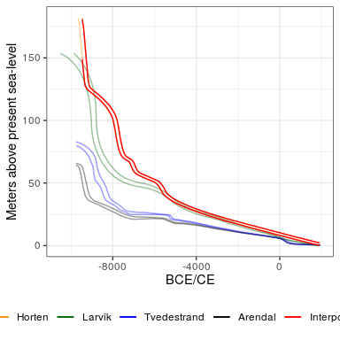
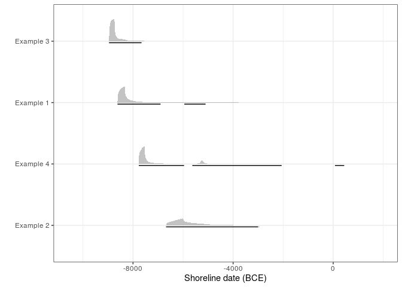

<!-- README.md is generated from README.Rmd. Please edit that file -->

# shoredate

<!-- badges: start -->

[](https://www.gnu.org/licenses/gpl-3.0)
[](https://github.com/isakro/shoredate/actions/workflows/R-CMD-check.yaml)
[](https://app.codecov.io/gh/isakro/shoredate?branch=master)
<!-- badges: end -->

The goal of *shoredate* is to offer methods to shoreline date Stone Age
sites located along the Norwegian Skagerrak coast based on their
present-day elevation and the trajectory of past relative sea-level
change. The method is based on an empirically derived estimate of the
likely elevation of the sites above sea-level when they were in use (see
Roalkvam 2023 for details).

## Installation

You can install the development version of *shoredate* from
[GitHub](https://github.com/isakro/shoredate) with:

``` r
# install.packages("devtools")
devtools::install_github("isakro/shoredate")
```

## Geographical and temporal coverage

As the method of shoreline dating is contingent on relative sea-level
change, it is dependent on good geological reconstructions of this
development. At present, the method as outlined here is therefore
limited to being applicable in the region of south-eastern Norway
between Horten in the north east to Arendal in the south west. This
region has recently compiled shoreline displacement curves for Horten
(Romundset 2021) Larvik (Sørensen et al. 2014; Sørensen et al. 2023),
Tvedestrand (Romundset 2018; Romundset et al. 2018) and Arendal
(Romundset 2018). The region also formed the study area for Roalkvam
2023, in which the method and its parameters were derived. The spatial
coverage is indicated in the maps below. The isobases in the second
figure correspond to displacement curves and place names in the third
figure which indicates the temporal coverage of the package:

    #> ℹ Map tiles by Stamen Design, under CC BY 3.0. Data by OpenStreetMap, under ODbL.


Furthermore, as human occupation in the region only occurred some time
after the retreat of the ice, the currently oldest known sites are from
around 9300 BCE (e.g. Glørstad 2016). The oldest possible age to achieve
with *shoredate* is 9460 BCE, although no sites are yet known to be that
old. A warning is given if a site location is outside the spatial extent
outlined above, but the dating procedure is still performed. If a site
has an elevation that implies a date older than 9460 BCE the date is
returned as NA and a warning is given.

In Roalkvam 2023 it was found that sites tend to be located on or close
to the shoreline up until around the transition to the Late Neolithic,
c. 2500 BCE, which thus marks the upper limit for the applicability of
the method. A date that has a later start date than this is therefore
returned as NA with a warning. The temporal range is indicated by the
dashed lines in the plot displaying the shoreline displacement curves,
above. Additionally, if a date extends beyond 1950 CE (0 cal BP), thus
indicating a site location below the present sea-level, this
overshooting probability is cut off and the date is normalised to sum to
unity.

## Interpolating shoreline displacement to a site location

To date a site, a reconstruction of local shoreline displacement is
necessary. There are currently four reliable geological displacement
curves available from within the study area. Each of these is associated
with a shoreline isobase, along which the trajectory of relative
sea-level change has been the same. To find the local displacement
curve, the curves are interpolated to the site location using inverse
distance weighting, weighting the distances by the square of the inverse
distance between site and isobases.

``` r
library(shoredate)

# Create example point using the required coordinate system WGS84 UTM32N (EPSG: 32632).
target_point <- sf::st_sfc(sf::st_point(c(538310, 6544255)), crs = 32632)

target_curve <- interpolate_curve(target_point)

displacement_plot(target_curve)
```



This interpolation procedure is performed under the hood for each site
when calling `shoreline_date()`.

## Example of shoreline dating a site

Below is a basic example outlining how to date a single site by manually
specifying the site elevation using the default setting for the dating
procedure and for plotting the date.

``` r
# Using the example point from above and specifying it's elevation.
target_date <- shoreline_date(site = target_point, elevation = 70)

# Call to plot.
shoredate_plot(target_date)
```


The blue gamma distribution on the y-axis indicates the likely elevation
of the site above sea-level when it was in use which is described by an
empirically derived gamma distribution with the parameters of shape
()
= 0.286 and scale
()
= 0.048. The red envelope is the shoreline displacement curve as
interpolated to the site location. Transferring the probability from the
gamma distribution to the calendar scale using the displacement curve
gives the resulting shoreline date in grey which is underlined with the
95% highest density region in black. By default, the shoreline date is
normalised to sum to unity. The default resolution on the calendar scale
is 10 years, but this can be adjusted to any power of 10 (including 1).

Calling the the date object, which has the custom class
`shoreline_date`, prints the name of the site, its elevation and the
HDR:

``` r
target_date
#> ===============
#> Site:  1
#> Elevation:  70 
#> 
#> 95% HDR:
#> 8620 BCE-6900 BCE
#> 5950 BCE-5100 BCE
```

It is also possible to plot a more sparse version of the date by
specifying what elements are to be excluded:

``` r
shoredate_plot(target_date, elevation_distribution = FALSE, 
               displacement_curve = FALSE, highest_density_region = FALSE)
```


It is also possible to date multiple sites at once. The default
behaviour when providing multiple shoreline dates is to plot a series of
individual plots for each date. However, setting `multiplot = TRUE` when
calling `shoredate_plot()` collapses the dates on a single plot that is
more sparse, ordering the sites from earliest to latest possible start
date for the occupation of the sites.

``` r
# Creating multiple points to be dated.
target_points <- sf::st_sfc(sf::st_point(c(538310, 6544255)),
                              sf::st_point(c(538300, 6544250)),
                              sf::st_point(c(517491, 6511426)),
                              sf::st_point(c(502059, 6495402)))

# Specifying the correct CRS and making the points a sf data frame.
target_points <- sf::st_as_sf(target_points, crs = 32632)

# If a column is added to the data frame, this will be used as the site names.
# If not, the sites will simply be numbered as they are passed to
# shoreline_date().
target_points$names <- c("Example 1", "Example 2", "Example 3", "Example 4")

# Performing shoreline dating, specifying site elevations. 
target_dates <- shoreline_date(sites = target_points, 
                               elevation = c(70, 46, 62, 30))

# Plot the dates with 95% HDRs (these can be removed by setting 
# highest_density_region = FALSE).
shoredate_plot(target_dates, multiplot = TRUE)
```



# References

Glørstad, H. 2016 Deglaciation, sea-level change and the Holocene
colonization of Norway. *Geological Society, London, Special
Publications* 411(1):9–25. DOI:
[10.1144/SP411.7](http://sp.lyellcollection.org/lookup/doi/10.1144/SP411.7)

Romundset, A. 2018. Postglacial shoreline displacement in the
Tvedestrand–Arendal area. In *The Stone Age Coastal Settlement in
Aust-Agder, Southeast Norway*, edited by Gaute, Reitan and Lars
Sundström. Cappelen Damm Akademisk, Oslo, pp. 463–478. DOI:
[10.23865/noasp.50](https://doi.org/10.23865/noasp.50)

Romundset, A. 2021 *Resultater fra NGUs undersøkelse av etteristidas
strandforskyvning nord i Vestfold*. Geological Survey of Norway,
Trondheim.

Romundset, A., Lakeman, T.R. and Høgaas, F. 2018. Quantifying variable
rates of postglacial relative sea level fall from a cluster of 24
isolation basins in southern Norway. *Quaternary Science Reviews*
197:175e192. DOI: [https://doi.org/10.1016/
j.quascirev.2018.07.041](http://www.sciencedirect.com/science/article/pii/S0277379118302890)

Roalkvam, I. 2023 A simulation-based assessment of the relation between
Stone Age sites and relative sea-level change along the Norwegian
Skagerrak coast. *Quaternary Science Reviews* 299:107880. DOI:
[10.1016/j.quascirev.2022.107880](https://www.sciencedirect.com/science/article/pii/S027737912200511X)

Sørensen, R, Henningsmoen, K.E. Høeg, H.I. and Gälman V. 2023. Holocen
vegetasjonshistorie og landhevning i søndre Vestfold og sørøstre
Telemark. In *The Stone Age in Telemark. Archaeological Results and
Scientific Analysis from Vestfoldbaneprosjektet and E18
Rugtvedt–Dørdal*, edited by Per Persson and Steinar Solheim, in press.

Sørensen, R, Henningsmoen, K.E. Høeg, H.I. and Gälman V. 2014 Holocene
landhevningsstudier i søndre Vestfold og sørøstre Telemark – Revidert
kurve. In *Vestfoldbaneprosjektet. Arkeologiske undersøkelser i
forbindelse med ny jernbane mellom Larvik og Porsgrunn. Bind 1*, edited
by Stine Melvold and Per Persson. Portal forlag, Kristiansand,
pp. 36–47. DOI: [10.23865/noasp.61](https://doi.org/10.23865/noasp.61)
