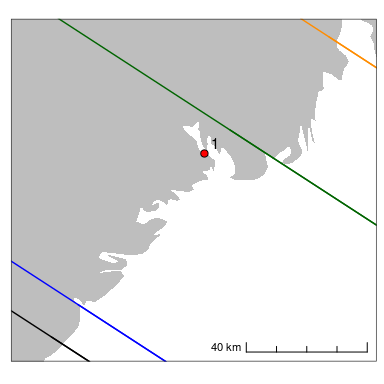
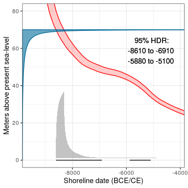

<!-- README.md is generated from README.Rmd. Please edit that file -->

# shoredate

<!-- badges: start -->

[](https://cran.r-project.org/package=shoredate)
[](https://www.gnu.org/licenses/gpl-3.0)
[](https://github.com/isakro/shoredate/actions/workflows/R-CMD-check.yaml)
[](https://app.codecov.io/gh/isakro/shoredate?branch=master)
<!-- badges: end -->

The package *shoredate* offers methods to shoreline date Stone Age sites
located along the Norwegian Skagerrak coast based on their present-day
elevation and the trajectory of past relative sea-level change.
Shoreline dating is based on the premise that coastal Stone Age sites in
the region were located on or close to the shoreline when they were in
use, and is implemented here based on an empirically derived estimate of
the likely elevation of the sites above sea-level when they were
occupied (Roalkvam 2023). However, do note that as the method is
dependent on regularities in human behaviour and as the Roalkvam (2023)
study provides an initial formalisation of the method, it is hefted with
unexplored uncertainties. Consequently, the dates achieved with the
package should be treated with care.

## Installation and loading

*shoredate* can be installed from
[CRAN](https://cran.r-project.org/package=shoredate) with:

``` r
install.packages("shoredate")
```

The latest development version can be installed from
[GitHub](https://github.com/isakro/shoredate) using `devtools`:

``` r
# install.packages("devtools")
devtools::install_github("isakro/shoredate")
```

When it has been installed the package can be loaded:

``` r
library(shoredate)
```

## Geographical and temporal coverage

As the method of shoreline dating is determined by relative sea-level
change, it is dependent on reliable geological reconstructions of this
development. At present, the method as outlined here is therefore
limited to being applicable in the region of south-eastern Norway
between Horten in the north east to Arendal in the south west. This
region has newly compiled shoreline displacement curves for Horten
(Romundset 2021), Porsgrunn (Sørensen et al. 2014; Sørensen et
al. 2023), Tvedestrand (Romundset 2018; Romundset et al. 2018) and
Arendal (Romundset 2018). The region also formed the study area for
Roalkvam (2023), in which the method and its parameters were derived.
The spatial coverage is indicated in the maps below. The shoreline
isobases in the second figure represent contours along which the
shoreline displacement has followed the same trajectory. These
correspond to the displacement curves and place names in the third
figure, which also indicates the temporal coverage of the package.

Note that spatial data used with the package should be set to WGS 84 /
UTM zone 32N (EPSG:32632).


As human occupation in the region only occurred some time after the
retreat of the Fennoscandian Ice Sheet, the currently oldest known sites
in Norway are from around 9300 BCE (e.g. Glørstad 2016). The oldest
possible age to achieve with *shoredate* is 9469 BCE, although no sites
are yet known to be that old. A warning is given if a site location is
outside the spatial extent outlined above, as this involves a more
uncertain extrapolation of the development of shoreline displacement.
However, the dating procedure is still performed. Conversely, if a site
has an elevation that implies a date older than 9469 BCE the date is
returned as NA and a warning is given.

In Roalkvam (2023) it was found that sites tend to be located on or
close to the shoreline up until around the transition to the Late
Neolithic, c. 2500 BCE, which thus marks the upper limit for the
applicability of the method. A date that has a later start date than
this is therefore returned as NA with a warning. The temporal range is
indicated by the dashed lines in the plot above that displays the
shoreline displacement curves. Additionally, if the probability of a
date extends beyond 1950 CE (0 cal BP), thus indicating a site location
below the present-day sea-level, this overshooting probability is cut
off and the date is normalised to sum to unity.

## Interpolating shoreline displacement to a site location

To shoreline date a site, a reconstruction of local shoreline
displacement is necessary. There are currently four reliable geological
displacement curves available from within the study area. Each of these
is associated with a shoreline isobase, along which the trajectory of
relative sea-level change has been the same. To find the local
displacement curve, the curves are interpolated to a site location using
inverse distance weighting, where the default is to weigh the
interpolation by the square of the inverse distance between site and
isobases.

``` r
# Create example point using the required coordinate system WGS84 / UTM zone 32N (EPSG: 32632)
target_point <- sf::st_sfc(sf::st_point(c(538310, 6544255)), crs = 32632)

# Simple map showing the target location relative to the isobases of the displacement curves
target_plot(target_point)
```



``` r
# Interpolate shoreline displacement curve for the target location
target_curve <- interpolate_curve(target_point)

# Plot displaying the interpolated curve 
displacement_plot(target_curve)
```


This interpolation is performed under the hood for each site when
calling `shoreline_date()`, which performs the shoreline dating
procedure.

## Shoreline dating a site

Below is a basic example outlining how to date a single site by manually
specifying the site elevation. The default settings are used for the
dating procedure and for plotting the resulting shoreline date.

``` r
# Using the example point from above and specifying it's elevation
target_date <- shoreline_date(site = target_point, elevation = 70)

# Call to plot
shoredate_plot(target_date)
```



The blue gamma distribution on the y-axis represents the likely
elevation of the site above sea-level when it was in use, which is
described by an empirically derived gamma distribution with the
parameters $\alpha$ (shape) = 0.286 and $\sigma$ (scale) = 20.833. This
starts from the elevation of the site. The red envelope is the shoreline
displacement curve as interpolated to the site location. The probability
from the gamma distribution is transferred to the calendar scale using
the displacement curve. This gives the resulting shoreline date in grey,
which is underlined by the 95% highest density region (HDR) in black
(see Roalkvam 2023 for more details). By default, the shoreline date is
normalised to sum to unity. The default resolution on the calendar scale
is 10 years.

Calling the date object, which has the custom class `shoreline_date`,
prints the name of the site, its elevation and the HDR:

``` r
target_date
#> ===============
#> Site:  1
#> Elevation:  70 
#> 
#> 95% HDR:
#> 8610 BCE-6910 BCE
#> 5880 BCE-5100 BCE
```

The first column of a data frame beyond the geometry of the spatial
objects will be taken to represent site names. If no such column exist,
the sites are simply numbered as they are passed to `shoreline_date()`.

## Shoreline dating multiple sites

It is also possible to date multiple sites at once.

``` r
# Creating multiple points to be dated
target_points <- sf::st_sfc(sf::st_point(c(538310, 6544255)),
                              sf::st_point(c(538300, 6544250)),
                              sf::st_point(c(517491, 6511426)),
                              sf::st_point(c(502059, 6495402)))

# Specifying the correct CRS and making the points a sf data frame
target_points <- sf::st_as_sf(target_points, crs = 32632)

# Adding example names
target_points$name <- c("Example 1", "Example 2", "Example 3", "Example 4")
# Adding fictitious site elevations
target_points$elevation <- c(70, 46, 62, 30)

# Perform shoreline dating
target_dates <- shoreline_date(sites = target_points, 
                               elevation = target_points$elevation)
```

``` r
# Print the dates to console
target_dates
#> ===============
#> Site:  Example 1
#> Elevation:  70 
#> 
#> 95% HDR:
#> 8610 BCE-6910 BCE
#> 5880 BCE-5100 BCE
#> ===============
#> Site:  Example 2
#> Elevation:  46 
#> 
#> 95% HDR:
#> 6660 BCE-3180 BCE
#> ===============
#> Site:  Example 3
#> Elevation:  62 
#> 
#> 95% HDR:
#> 8940 BCE-7720 BCE
#> ===============
#> Site:  Example 4
#> Elevation:  30 
#> 
#> 95% HDR:
#> 7760 BCE-6020 BCE
#> 5610 BCE-2400 BCE
#> 2320 BCE-2140 BCE
#> 110 CE-430 CE
```

The default behaviour when providing multiple shoreline dates to
`shoredate_plot()` is to plot a series of individual plots. However,
setting `multiplot = TRUE` collapses the dates on a single plot that is
more sparse, ordering the sites from earliest to latest possible start
date for the occupation of the sites.

``` r
shoredate_plot(target_dates, multiplot = TRUE)
```


The procedures outlined above have focused on the basic functions and
default behaviours of the package. For further usage and a more detailed
walk through, see the vignette by calling `vignette("shoredate")`.

# References

Glørstad, H. 2016 Deglaciation, sea-level change and the Holocene
colonization of Norway. *Geological Society, London, Special
Publications* 411(1):9–25. DOI:
[10.1144/SP411.7](https://doi.org/10.1144/SP411.7)

Romundset, A. 2018. Postglacial shoreline displacement in the
Tvedestrand–Arendal area. In *The Stone Age Coastal Settlement in
Aust-Agder, Southeast Norway*, edited by Gaute Reitan and Lars
Sundström. Cappelen Damm Akademisk, Oslo, pp. 463–478. DOI:
[10.23865/noasp.50](https://doi.org/10.23865/noasp.50)

Romundset, A. 2021 *Resultater fra NGUs undersøkelse av etteristidas
strandforskyvning nord i Vestfold*. Geological Survey of Norway,
Trondheim.

Romundset, A., Lakeman, T.R. and Høgaas, F. 2018. Quantifying variable
rates of postglacial relative sea level fall from a cluster of 24
isolation basins in southern Norway. *Quaternary Science Reviews*
197:175e192. DOI: [10.1016/
j.quascirev.2018.07.041](https://www.sciencedirect.com/science/article/pii/S0277379118302890)

Roalkvam, I. 2023 A simulation-based assessment of the relation between
Stone Age sites and relative sea-level change along the Norwegian
Skagerrak coast. *Quaternary Science Reviews* 299:107880. DOI:
[10.1016/j.quascirev.2022.107880](https://doi.org/10.1016/j.quascirev.2022.107880)

Sørensen, R, Henningsmoen, K.E. Høeg, H.I. and Gälman V. 2023. Holocen
vegetasjonshistorie og landhevning i søndre Vestfold og sørøstre
Telemark. In *The Stone Age in Telemark. Archaeological Results and
Scientific Analysis from Vestfoldbaneprosjektet and E18
Rugtvedt–Dørdal*, edited by Per Persson and Steinar Solheim, in press.

Sørensen, R, Henningsmoen, K.E. Høeg, H.I. and Gälman V. 2014 Holocene
landhevningsstudier i søndre Vestfold og sørøstre Telemark – Revidert
kurve. In *Vestfoldbaneprosjektet. Arkeologiske undersøkelser i
forbindelse med ny jernbane mellom Larvik og Porsgrunn. Bind 1*, edited
by Stine Melvold and Per Persson. Portal forlag, Kristiansand,
pp. 36–47. DOI: [10.23865/noasp.61](https://doi.org/10.23865/noasp.61)

# Contributing

Contributions and suggestions for improvement are all very welcome.
Instructions for contributing can be found in the [Guide to
Contributing](https://github.com/isakro/shoredate/blob/master/CONTRIBUTING.md).
Please note that this project is released with a [Contributor Code of
Conduct](https://github.com/isakro/shoredate/blob/master/.github/CODE_OF_CONDUCT.md).
By participating in this project you agree to abide by its terms.
