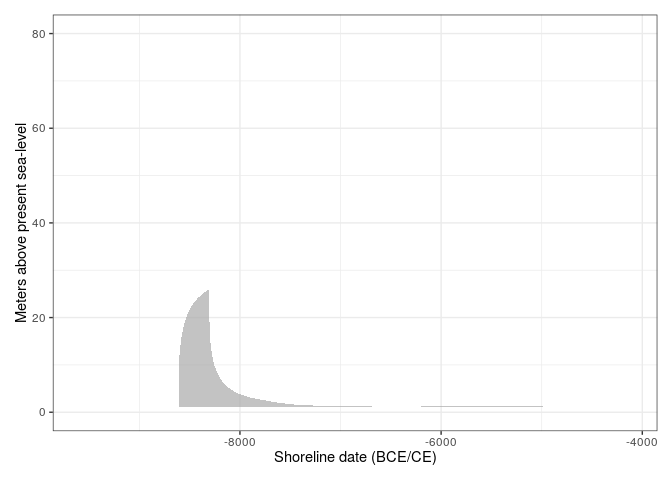

<!-- README.md is generated from README.Rmd. Please edit that file -->

# shoredate

<!-- badges: start -->
<!-- badges: end -->

The goal of *shoredate* is to offer methods to shoreline date Stone Age
sites located along the Norwegian Skagerrak coast based on their
present-day elevation and the trajectory of relative sea-level change.

## Installation

You can install the development version of *shoredate* from
[GitHub](https://github.com/isakro/shoredate) with:

``` r
# install.packages("devtools")
devtools::install_github("isakro/shoredate")
```

## Example

This is a basic example outlining how to date a single site by manually
specifying the site elevation, and using the default setting for the
dating procedure as well as for plotting the date.

``` r
library(shoredate)

# Create example point using the required coordinate system WGS84 UTM32N (EPSG: 32632).
target_point <- sf::st_sfc(sf::st_point(c(579570, 6582982)), crs = 32632)

target_date <- shoreline_date(site = target_point, elevation = 65)

shoredate_plot(target_date)
```


It is also possible to plot a more sparse version of the plot by
specifying what elements are to be excluded:

``` r
shoredate_plot(target_date, elevation_distribution = FALSE, displacement_curve = FALSE,
               parameters = FALSE, hdr_label = FALSE)
```


