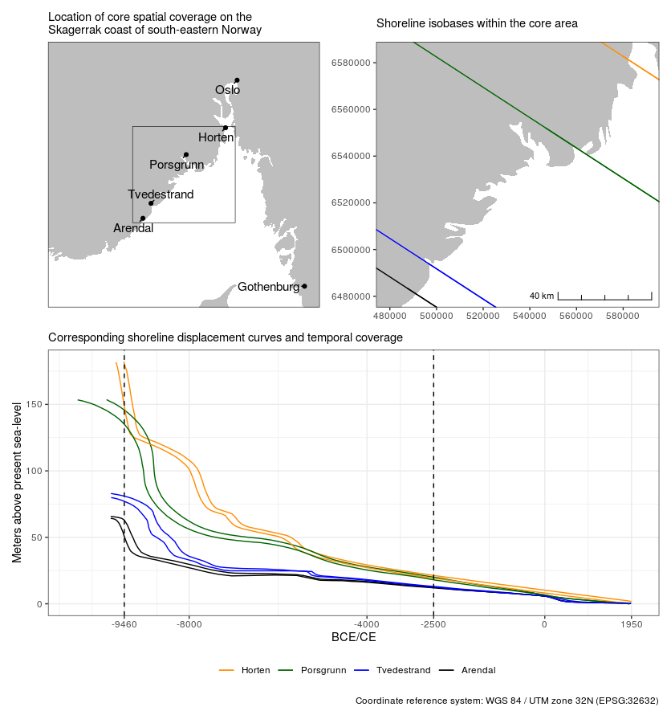
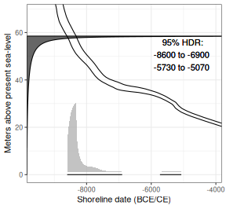
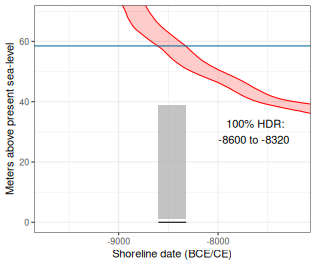
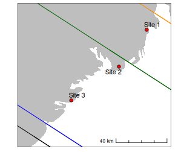
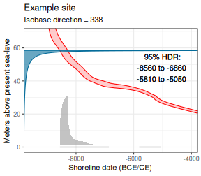

# Introduction
The concept of dating sites based on their present-day elevation with reference to past shoreline displacement has been an important tool for archaeologists in northern Scandinavia since the early 1900s (e.g. Brøgger 1905). This is based on the observation that Stone Age sites in the region tend to have been located close to the contemporaneous shoreline when they were in use. Furthermore, following the retreat of the Fennoscandian Ice Sheet, the isostatic uplift has been so severe that despite corresponding eustatic sea-level rise, the relative sea-level has been falling throughout prehistory in large parts of this region. Within any given area where this is the case, the general pattern is thus that older sites will be located at higher altitudes than younger sites.

This vignette describes the R package *shoredate* which provides tools for shoreline dating Stone Age sites located on the Norwegian Skagerrak coast using the approach presented in Roalkvam (2023). This is based on an empirical evaluation of the likely elevation of the sites above sea-level when they were in use, and the local trajectory of past relative sea-level change. Due to the geographical contingency of the method, and the dependency on geological reconstructions of shoreline displacement, the functionality of the package was developed for the purposes of dating coastal sites located in the region stretching from Horten county in the north east, to Arendal county in the south west. However, in the [second vignette](https://isakro.github.io/shoredate/articles/extending-shoredate.html), ways in which the core functionality of the package could be applied in other areas of the world are presented.

## Geographical and temporal coverage

Shoreline dating of Stone Age sites in northern Scandinavia is based on the premise that coastal sites within the region tend to have been located on or close to the shoreline when they were in use. By reconstructing the past trajectory of shoreline displacement, this thus allows us to ascribe an approximate date to when the sites were in use, based on their present-day elevation. The method is therefore dependent on local relative sea-level change and the likely elevation of the sites above sea-level when they were in use.

As the method is dependent on good geological reconstructions of shoreline displacement, the full functionality of *shoredate* is at present limited to being applicable in the region of south-eastern Norway between Horten in the north east to Arendal in the south west. This region has recently compiled shoreline displacement curves for Skoppum in Horten (Romundset 2021), Gunnarsrød in Porsgrunn (Sørensen et al. 2014a; Sørensen et al. *in prep*), Hanto in Tvedestrand (Romundset 2018; Romundset et al. 2018) and Bjørnebu in Arendal (Romundset 2018). This region also formed the study area for Roalkvam (2023), in which the specification of the method and the parameters used here were derived. The core spatial coverage of *shoredate* is indicated in the maps below.



Furthermore, as human occupation in the region only occurred some time after the retreat of the Fennoscandian Ice Sheet, the oldest known sites are dated to around 9300 BCE (e.g. Glørstad 2016). 9469 BCE is the latest start date among the geologically derived displacement curves in the region, and thus marks the oldest possible age to achieve with *shoredate* here, although no sites are yet known to be that old. If a site has an elevation that implies a date older than the latest start date of the displacement curves, the date is returned as NA and a warning is given.

In the Roalkvam (2023) study it was found that sites tend to be situated at more removed and variable distances from the shoreline from around 2500 BCE. By default, this therefore marks the upper limit of the method, where dates with a start date after 2500 BCE are returned as NA.

## Installing and loading *shoredate*

The package can be installed from [CRAN](https://cran.r-project.org/package=shoredate):


```r
install.packages("shoredate")
```

The development version of the package can be installed from the [GitHub repository](https://github.com/isakro/shoredate). This requires the `devtools` package. Note that the development version can be unstable.


```r
# Uncomment and run to install devtools
# install.packages("devtools")

# Installation requires devtools
devtools::install_github("isakro/shoredate")
```

When installed the package can be loaded.

```r
library(shoredate)
```


# Interpolating shoreline displacement to a site location

The function `shoreline_date()` forms the basis for *shoredate*, and is presented in more detail below. Unless a precompiled displacement curve is provided when calling `shoreline_date()`, the trajectory of shoreline displacement at the location of the sites to be dated is interpolated under the hood. This is based on the four different geological reconstructions of shoreline displacement along the Norwegian Skagerrak coat. Each of these displacement curves are associated with a shoreline isobase which indicates contours along which the relative sea-level change has followed the same trajectory. The variation in the rate of sea-level change is mainly determined by the degree of isostatic uplift, which is higher along a gradient than runs from the south west to the north east within the region. The shoreline displacement curve for any given location within the region is interpolated using the `interpolate_curve()` command, using inverse distance weighting, where the distance to the four isobases is weighted by the square of the inverse distances.

Note that spatial geometries representing sites to which interpolate_curve() is to be applied must be set to the coordinate reference system (CRS) WGS 84 / UTM zone 32N (EPSG:32632). Furthermore, a warning is given if one attempts to interpolate the trajectory for shoreline displacement at a site located outside the spatial extent outlined above. However, as there might still be use-cases where it could be useful to extrapolate the method outside this limit, the procedure is still performed (see the second vignette [Applying shoredate to other regions](doc/extending-shoredate.html) for suggestions on how to apply the package to entirely different regions).


```r
# Create example point using the required coordinate system
target_point <- sf::st_sfc(sf::st_point(c(517250, 6527250)), crs = 32632)

# Interpolate the displacement curve
target_curve <- interpolate_curve(target_point)
```

To visualise the interpolated curve alongside the geological reconstructions, this can be passed to `displacement_plot()`. A simple map showing the location of one or more target sites relative to the isobases can also be displayed by using the command `target_plot()`.


```r
target_plot(target_point)
```


```r
# The opactity of the geological displacement curves is reduced with
# displacement_alpha
displacement_plot(target_curve, displacement_alpha = 0.4)
```


# Shoreline dating

The following section outlines how to perform shoreline dating and ways in which to visualise the results. Various parameters and helper-functions underlying the dating procedure are also presented, along with ways to manipulate these if one wishes to explore the sensitivity of the dates or believe other parameters than the defaults are more sensible in a given setting.

## Dating a single site

To perform a basic shoreline date, a site has to be provided as a spatial `sf` object if the shoreline displacement is to be interpolated to its location. In a addition to this, the elevation of the site above the present sea-level has to be provided. This can either be done by manually specifying the elevation, or by providing an elevation raster (see below), in which case the elevation of the site will be derived from the raster, provided the site is given as a spatial object. In Roalkvam (2023) it was found that the vertical distance from the sites to the contemporaneous shoreline within the study region could be reasonably approximated by a gamma distribution. This forms the foundation for the implementation of shoreline dating in the package.


```r
# Date the example point, manually specifying it's elevation
target_date <- shoreline_date(target_point, elevation = 58.5)
```

The results can then be plotted using the `shoredate_plot()` command:


```r
shoredate_plot(target_date)
```


The blue gamma distribution on the y-axis indicates the likely elevation of the site above sea-level when it was in use, which is described by an empirically derived gamma distribution with the parameters shape ($\alpha$) = 0.286 and scale ($\sigma$) = 20.833. These parameters can be adjusted by specifying the values passed to `model_parameters` when calling `shoreline_date()`. The red envelope is the shoreline displacement curve as interpolated to the site location with `interpolate_curve()`, which is run under the hood if a curve is not provided to the `target_curve` argument of `shoreline_date()`.

Transferring the probability from the gamma distribution to the calendar scale using the displacement curve gives the resulting shoreline date in grey, which is underlined with the 95% highest density region (HDR) in black. The coverage of the HDR can be adjusted with the `hdr_prob` parameter. The dating procedure involves stepping through the cumulative version of the gamma distribution, and at each step subtracting the probability at the previous step from the current one. The probability at each step is divided uniformly across the calendar years in the range between the lower and upper limit of the displacement curve. The default resolution on the calendar scale is 10 years, but this can be adjusted by specifying the `cal_reso` argument. The gamma distribution is stepped through using increments of 0.01m, which can be adjusted by using the argument `elev_reso`. By default, the resulting shoreline date is normalised to sum to unity.

The function `shoreline_date()` returns an object of class `shoreline_date`. By calling the object the dates are printed to console, displaying site name, site elevation and the HDR of the date. Furthermore, the first column of a data frame beyond the `geom` column holding the `sf` geometry will be used as site names. If no such column is present, the sites will simply be numbered as they are passed to `shoreline_date()`.


```r
target_date
```

```
## ===============
## Site:  1
## Elevation:  58.5 
## 
## 95% HDR:
## 8600 BCE-6900 BCE
## 5730 BCE-5070 BCE
```

While a range of graphical parameters can be adjusted to change the appearance of the output plot, setting `greyscale = TRUE` offers a short-cut to plot a date in greyscale:


```r
shoredate_plot(target_date,  greyscale = TRUE)
```



A more sparse version can also be plotted by specifying what elements are to be excluded from the plot:


```r
shoredate_plot(target_date, elevation_distribution = FALSE,
               displacement_curve = FALSE, highest_density_region = FALSE)
```


## Finding the *terminus post quem* date

It is also possible to not account for the likely distance between the site and the shoreline. This is done by setting the `model` parameter to "none" when calling `shoreline_date()`. This thus effectively provides a *termnius post quem* date, the earliest possible date for when the site could have been in use, under the assumption that when the sea receded from the site location marks the earliest possible point in time for the occupation of the site.


```r
# Date the example point, manually specifying it's elevation
tpq_date <- shoreline_date(target_point,
                           elevation = 58.5,
                           model = "none")

# Plot and adjust the position of the HDR label on the y-axis
shoredate_plot(tpq_date, hdr_label_yadj = 0.5)
```



## Dating multiple sites

As exemplified in the code chunks to follow, it is also possible to date multiple sites at once.


```r
# Create multiple example points to be dated
target_points <- sf::st_sfc(sf::st_point(c(576052, 6567955)),
                              sf::st_point(c(554212, 6538835)),
                              sf::st_point(c(516599, 6512142)))

# Specify the correct CRS and make the points a sf data frame to be able to
# add the column below
target_points <- sf::st_as_sf(target_points, crs = 32632)

# Adding example site names
target_points$names <- c("Site 1", "Site 2", "Site 3")

# Create a plot showing the location of the points within the spatial limit
target_plot(target_points)
```



When dating multiple sites it can be useful to track the progress by setting `verbose = TRUE` to print the progress to console (this output is not reproduced here).


```r
# Dating the target points, specifying the elevations in a
# vector of numeric values
target_dates <- shoreline_date(target_points,
                               elevation = c(68, 98, 73),
                               verbose = TRUE)
```


```r
# Print results
target_dates
```

```
## ===============
## Site:  Site 1
## Elevation:  68 
## 
## 95% HDR:
## 7630 BCE-6110 BCE
## 6000 BCE-5430 BCE
## ===============
## Site:  Site 2
## Elevation:  98 
## 
## 95% HDR:
## 9020 BCE-8470 BCE
## ===============
## Site:  Site 3
## Elevation:  73 
## 
## 95% HDR:
## 9170 BCE-8340 BCE
```

The default behaviour when passing multiple dates to `shoredate_plot()` is to plot a series of individual plots. However, setting `multiplot = TRUE` collapses the dates on a single, more sparse plot. The sites are ordered from from earliest to latest possible start date for the occupation of the sites.


```r
shoredate_plot(target_dates, multiplot = TRUE)
```


## Using an elevation raster to find site elevations

The below code demonstrates how to find the elevation of one or more sites by passing a digital elevation model (DEM) to `shoreline_date()`. The example here uses data from Amazon Web Service Terrain Tiles, retrieved with the package `elevatr`. However, the best elevation data available for the study area can be retrieved freely from the Norwegian Mapping Authority at https://hoydedata.no/LaserInnsyn2/. To use this with *shoredate*, manually download a raster covering the location of the sites to be dated and read this in to R with `terra::rast()` before passing it to `shoreline_date()`.


```r
# Reproject target_point for retrieving raster data with elevatr
target_wgs84 <- sf::st_transform(target_point, crs = 4326)

# Retrieve raster data
elev_raster <- elevatr::get_elev_raster(target_wgs84, z = 14,  src = "aws")

# Make the retrieved raster a SpatRaster and re-project
# it to the correct coordinate system
elev_raster <- terra::project(terra::rast(elev_raster), "epsg:32632")

# Plot the raster and target point for inspection
terra::plot(elev_raster)
plot(target_point, add = TRUE)
```


When a `SpatRaster` has been loaded into the R session this can be passed to `shoreline_date()` by specifying it in the `elevation` argument. This is then used to find the site elevations without having to provide these manually, as was done above. Note that if a site is represented by an object with a spatial extent (i.e. not a point feature) the default is to use the mean of the elevation on the raster. This can be changed with the `elev_fun` argument which accepts any function that can be passed to the `fun` argument in `terra::extract()` (see `?terra::extract`).


```r
raster_date <- shoreline_date(target_point, elevation = elev_raster)

# Print to console
raster_date
```

```
## ===============
## Site:  1
## Elevation:  58.51383 
## 
## 95% HDR:
## 8600 BCE-6900 BCE
## 5730 BCE-5070 BCE
```

# Summed probability distribution of shoreline dates

Using `sum_shoredates()` it is also possible to sum the probability of multiple shoreline dates to evaluate the temporal intensity of the dates, as is frequently done with calibrated radiocarbon dates (e.g. Crema and Bevan 2021). Do note that as this procedure involves collapsing the frequency of dates and their uncertainty, the interpretation of the resulting sum is not straightforward, as it's shape is determined not only by the number of sites but also the trajectory of shoreline displacement (see e.g. Bronk Ramsey 2017; Crema 2022 for perspectives and ways to approach this issue in the context of radiocarbon dates).


```r
# Sum the three dates from above
summed_dates <- sum_shoredates(target_dates)
```

A simple line plot displaying the resulting summed probability can then be produced with `shoredate_sumplot()`.


```r
shoredate_sumplot(summed_dates)
```


# Direction of shoreline gradient
The direction of the shoreline gradient is specified by the isobases that run perpendicular to this gradient. When interpolating the displacement curve used for dating a site, the direction of these isobases defaults to 327$^\circ$, following Romundset et al. (2018:180, fig.1). However, some authors operate with different isobase directions, with Sørensen et al. (2014:fig.2.2.3) using 338$^\circ$. Furthermore, the direction of the uplift gradient might have varied throughout the Holocene (Sørensen et al. 2014:42--44).

## Specifying different isobase directions

While the range of the typically employed isobase directions generally result in minor differences in the resulting shoreline dates, it is possible to specify other and multiple directions for these, and perform the shoreline dating using each individual direction. This can be useful either for evaluating the sensitivity of a date or if one believes there is reason suspect a different direction than the default in a particular case.


```r
# Add a name to the example site
target_point <- sf::st_as_sf(target_point, crs = 32632)
target_point$name <- "Example site"

# Using the same target point and elevation as above, but specifying two
# different directions for the isobases when dating
iso_date <- shoreline_date(site = target_point, elevation = elev_raster,
                           isobase_direction = c(325, 338))

iso_date
```

```
## ===============
## Site:  Example site
## Elevation:  58.51383 
## 
## Isobase direction:  325 
## 
## 95% HDR:
## 8610 BCE-6900 BCE
## 5710 BCE-5070 BCE
## 
## Isobase direction:  338 
## 
## 95% HDR:
## 8560 BCE-6900 BCE
## 5810 BCE-5070 BCE
```

In the call to plot it can then be specified that the direction of the isobases is printed with each date. Note that it is not possible use `multiplot` when having used multiple isobase directions when dating the sites. The following thus also shows the default behaviour when plotting multiple dates at once and not setting `multiplot = TRUE`.


```r
shoredate_plot(iso_date,
               site_name = TRUE,
               isobase_direction = TRUE,
               hdr_label_yadj = 0.35)
```



## Sum the probability of dates across isobase directions

As an alternative to keeping the two shoreline dates of the site separate, the parameter `sum_isobase_directions` can be set to `TRUE` when calling `shoreline_date()` to sum the probability of the dates. Again, by default this is normalised to sum to unity.


```r
sum_iso_date <- shoreline_date(site = target_point,
                               elevation = elev_raster,
                               isobase_direction = c(325, 338),
                               sum_isobase_directions = TRUE)

sum_iso_date
```

```
## ===============
## Site:  Example site
## Elevation:  58.51383 
## 
## Sum of isobase directions:  325 338 
## 
## 95% HDR:
## 8610 BCE-6880 BCE
## 5760 BCE-5060 BCE
```

This can then be passed to `shoredate_plot()`. Note that the interpolated displacement curves and the gamma distribution for the elevation of the site above sea-level is not included in the plot when summing the probability of dates across isobase directions.


```r
shoredate_plot(sum_iso_date, site_name = TRUE, isobase_direction = TRUE)
```


# References

Bronk Ramsey, C. 2017. Methods for Summarizing Radiocarbon Datasets. *Radiocarbon* 59(6):1809--1833. DOI: [10.1017/RDC.2017.108](https://doi.org/10.1017/RDC.2017.108)

Brøgger, W.C. 1905 *Strandliniens beliggenhed under stenalderen i det sydøstlige Norge*. Geological Survey of Norway, Kristiania. URI: https://hdl.handle.net/11250/2675184

Crema, E. and Bevan, A. 2021. Inference from Large Sets of Radiocarbon Dates: Software and Methods. *Radiocarbon* 61(1):23--39. DOI: [10.1017/RDC.2020.95](https://doi.org/10.1017/RDC.2020.95)

Crema, E. 2022. Statistical Inference of Prehistoric Demography from Frequency Distributions of Radiocarbon Dates: A Review and a Guide for the Perplexed. *Journal of Archaeological Method and Theory* 29:1387-1418. DOI: [10.1007/s10816-022-09559-5](https://doi.org/10.1007/s10816-022-09559-5)

Glørstad, H. 2016. Deglaciation, sea-level change and the Holocene colonization of Norway. *Geological Society, London, Special Publications* 411(1):9--25. DOI: [10.1144/SP411.7](https://doi.org/10.1144/SP411.7)

Roalkvam, I. 2023 A simulation-based assessment of the relation between Stone Age sites and relative sea-level change along the Norwegian Skagerrak coast. *Quaternary Science Reviews* 299:107880. DOI: [10.1016/j.quascirev.2022.107880](https://doi.org/10.1016/j.quascirev.2022.107880)

Romundset, A. 2018. Postglacial shoreline displacement in the Tvedestrand--Arendal area. In *The Stone Age Coastal Settlement in Aust-Agder, Southeast Norway*, edited by Reitan, G. and Sundström, L.. Cappelen Damm Akademisk, Oslo, pp. 463--478. DOI: [10.23865/noasp.50](https://doi.org/10.23865/noasp.50)

Romundset, A. 2021. *Resultater fra NGUs undersøkelse av etteristidas strandforskyvning nord i Vestfold*. Geological Survey of Norway, Trondheim.

Romundset, A., Lakeman, T.R. and Høgaas, F. 2018. Quantifying variable rates of postglacial relative sea level fall from a cluster of 24 isolation basins in southern Norway. *Quaternary Science Reviews* 197:175e192. DOI: [10.1016/ j.quascirev.2018.07.041](https://doi.org/10.1016/j.quascirev.2018.07.041)

Sørensen, R, Henningsmoen, K.E. Høeg, H.I. and Gälman V. 2023. Holocen vegetasjonshistorie og landhevning i søndre Vestfold og sørøstre Telemark. In *The Stone Age in Telemark. Archaeological Results and Scientific Analysis from Vestfoldbaneprosjektet and E18 Rugtvedt--Dørdal*, edited by Persson, P. and Solheim, S., in press.

Sørensen, R, Henningsmoen, K.E. Høeg, H.I. and Gälman V. 2014. Holocene landhevningsstudier i søndre Vestfold og sørøstre Telemark -- Revidert kurve. In *Vestfoldbaneprosjektet. Arkeologiske undersøkelser i forbindelse med ny jernbane mellom Larvik og Porsgrunn. Bind 1*, edited by Melvold, S. and Persson, P. Portal forlag, Kristiansand, pp. 36--47. DOI: [10.23865/noasp.61](https://doi.org/10.23865/noasp.61)


